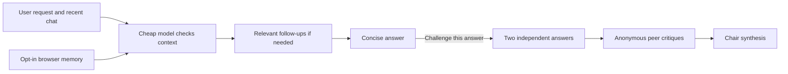

# Personalized AI Assistant MVP

> **Work in progress.** The original prototype was developed from July 25-27,
> 2025. It was recovered, hardened, and first published publicly in August 2026.

Most assistants answer an ambiguous question immediately. This experiment takes
a different path: ask a small number of useful questions, let the user confirm
their intent, and remember explicit choices so future conversations can begin
with better context and fewer repeated follow-ups.

## Product idea

The long-term goal is a personal assistant that learns carefully rather than
silently accumulating every conversation. Stable preferences, temporary context,
and inferred preferences should have different lifetimes and confidence levels.
Users should be able to inspect, correct, and delete everything remembered about
them.

This MVP implements the first useful slice of that idea:

- Generate up to three relevant clarification questions for an ambiguous request.
- Associate one selected answer with its exact question.
- Optionally remember those selections in the browser.
- Reuse remembered choices when generating later questions and answers.
- Inspect, remove, or clear remembered choices at any time.
- Keep every model credential on the backend.
- Create, rename, switch, and delete browser-local chats.
- Request a second opinion with “Challenge this answer”: two independent answers,
  anonymous peer critiques, and a concise chair synthesis. Incomplete reviews are labeled.

## Request flow



The React client talks only to FastAPI. The backend defaults to OpenRouter Gemini
Pro as an answer fallback and Claude Sonnet 4.6 for answers and a single batch of context questions, with Groq as a fallback when configured.
Each model call has a timeout and output limit. The review uses two models through
OpenRouter and runs only when requested. Its five calls (plus at most one retry per truncated call) can take longer and cost
more than a single answer. The UI shows provider-reported costs when available;
answer cost excludes the earlier context-selection call.

Selections stay in the chat; saving them as reusable memory is opt-in. Recent chat
history and selected context accompany follow-up requests. The independent review
answers do not see the initial answer; critiques and synthesis do. Failed stages
produce an incomplete review rather than an invented consensus.

## Current boundaries

This is not yet the full-memory assistant envisioned by the project:

- Chats and memory are browser-local storage, not a server-side user profile.
- There is no live web search or source verification. Model agreement is not proof
  of correctness, particularly for medical or other consequential questions.
- There is no authentication, cross-device synchronization, or encrypted store.
- There is no semantic retrieval, memory confidence, expiration, or conflict resolution.
- Clarification and answer quality do not yet have an evaluation dataset.
- Provider model IDs remain configurable because hosted model availability changes.

These boundaries are intentional for the WIP release. The next meaningful phase
is an event-backed memory service with user controls, retrieval, and measurable
rules for when the assistant should ask instead of assume.

## Run locally

Requirements: Python 3.11+, Node.js 22+, and an OpenRouter API key for the default
answer and council models. Groq is an optional answer fallback.

```bash
cp backend/.env.example backend/.env
# Add OPENROUTER_API_KEY to backend/.env; optionally add GROQ_API_KEY

python3 -m venv .venv
source .venv/bin/activate
pip install -r backend/requirements.txt
uvicorn main:app --app-dir backend --reload
```

In a second terminal:

```bash
cd frontend
npm install
npm run dev
```

Use `npm run dev -- --port 5174` if port 5173 is occupied.
Open the URL printed by Vite (normally `http://localhost:5173`). Vite proxies `/api` to the backend on port 8000.

The containerized setup is:

```bash
docker compose up --build
```

Then open `http://localhost:3000`.

Configure `CLARIFICATION_MODEL`, `ANSWER_MODEL`, `FALLBACK_MODEL`, `COUNCIL_MODELS`, and `CHAIR_MODEL`
in `backend/.env` using `provider:model-id` values. Council models must be distinct;
this prototype uses the first two configured models. Restart the backend after changes.
Never commit `.env` or API keys.

## Checks

```bash
python -m unittest discover -s backend/tests
cd frontend
npm test
npm run lint
npm run build
```

## Project timeline

- **July 25-27, 2025:** Built the first clarification-first React and FastAPI prototype.
- **August 2026:** Recovered the local prototype, secured provider calls, repaired
  interaction bugs, added explicit local memory and tests, and published it as a WIP.

Git history begins with the public WIP release. The earlier date is project
provenance, not a backdated public commit.

Optional personalization appears beside each completed answer. It requests at most three missing
relevant details, supports custom answers and opt-in memory, and generates a tailored response.
The current council uses Sonnet 4.6 and Gemini 2.5 Pro, with Sonnet as chair.

Broad outing requests can first resolve the activity, followed by one final batch of up to
three missing details. The last option selection advances automatically; custom text is
completed with Enter. Continue still allows partially answered batches, and Skip remains available.

Council calls reserve a separate Gemini reasoning allowance and retry once with a larger
output budget on truncation. Persistently truncated stages stop the review as incomplete;
reported costs include successful retry attempts and their initial responses.
