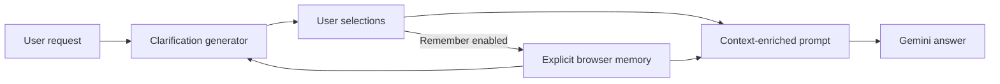

# Personalized AI Assistant MVP

> **Work in progress.** The original prototype was developed from July 25-27,
> 2025. It was recovered, hardened, and first published publicly in August 2026.

Most assistants answer an ambiguous question immediately. This experiment takes
a different path: ask a small number of useful questions, let the user confirm
their intent, and remember explicit choices so future conversations can begin
with better context and fewer repeated follow-ups.

## Product idea

The long-term goal is a personal assistant that learns carefully rather than
silently accumulating every conversation. Stable preferences, temporary context,
and inferred preferences should have different lifetimes and confidence levels.
Users should be able to inspect, correct, and delete everything remembered about
them.

This MVP implements the first useful slice of that idea:

- Generate up to four clarification questions for an ambiguous request.
- Associate one selected answer with its exact question.
- Optionally remember those selections in the browser.
- Reuse remembered choices when generating later questions and answers.
- Inspect, remove, or clear remembered choices at any time.
- Keep every model credential on the backend.

## Request flow



The React client talks only to FastAPI. FastAPI uses Groq for clarification when
`GROQ_API_KEY` is configured; otherwise it uses Gemini. Gemini produces the final
answer. The previous prototype's browser-visible Groq credential has been removed.

## Current boundaries

This is not yet the full-memory assistant envisioned by the project:

- Memory is explicit browser-local storage, not a server-side user profile.
- There is no authentication, cross-device synchronization, or encrypted store.
- There is no semantic retrieval, memory confidence, expiration, or conflict resolution.
- Clarification and answer quality do not yet have an evaluation dataset.
- Provider model IDs remain configurable because hosted model availability changes.

These boundaries are intentional for the WIP release. The next meaningful phase
is an event-backed memory service with user controls, retrieval, and measurable
rules for when the assistant should ask instead of assume.

## Run locally

Requirements: Python 3.11+, Node.js 22+, and at least a Gemini API key.

```bash
cp backend/.env.example backend/.env
# Add GEMINI_API_KEY to backend/.env

python3 -m venv .venv
source .venv/bin/activate
pip install -r backend/requirements.txt
uvicorn main:app --app-dir backend --reload
```

In a second terminal:

```bash
cd frontend
npm install
npm run dev
```

Open `http://localhost:5173`. Vite proxies `/api` to the backend on port 8000.

The containerized setup is:

```bash
docker compose up --build
```

Then open `http://localhost:3000`.

## Checks

```bash
python -m unittest discover -s backend/tests
cd frontend
npm test
npm run lint
npm run build
```

## Project timeline

- **July 25-27, 2025:** Built the first clarification-first React and FastAPI prototype.
- **August 2026:** Recovered the local prototype, secured provider calls, repaired
  interaction bugs, added explicit local memory and tests, and published it as a WIP.

Git history begins with the public WIP release. The earlier date is project
provenance, not a backdated public commit.
